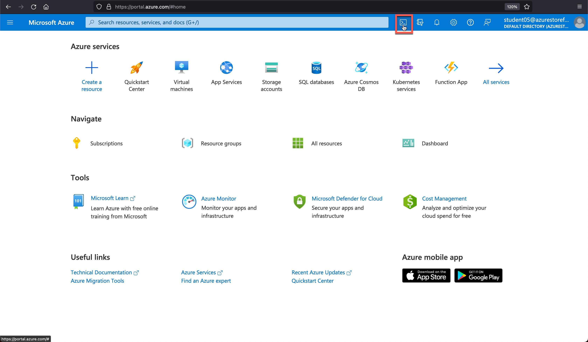
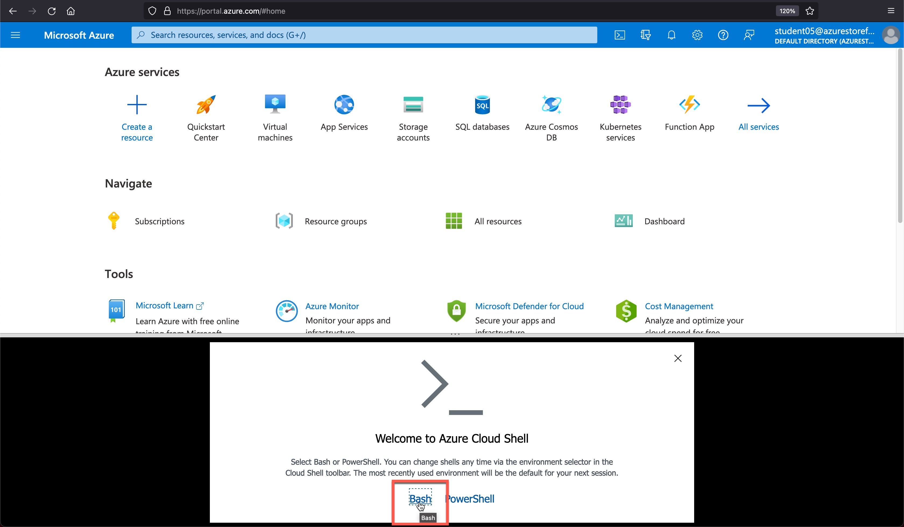
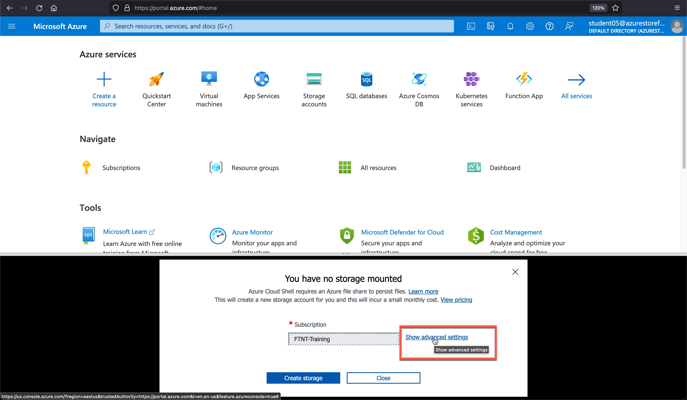
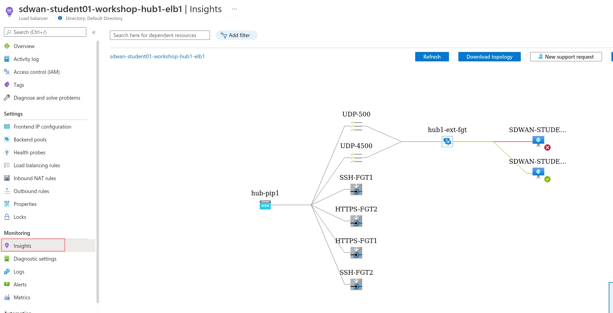
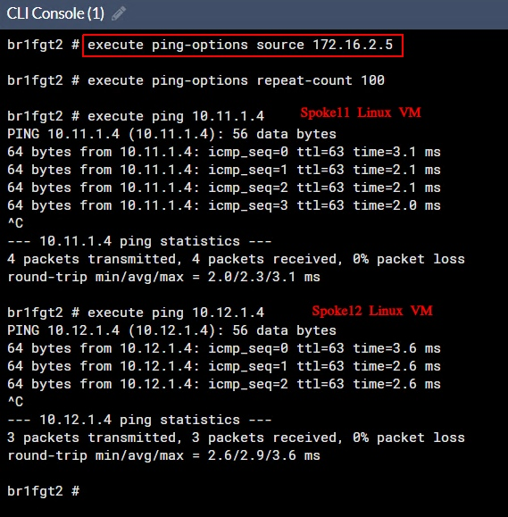
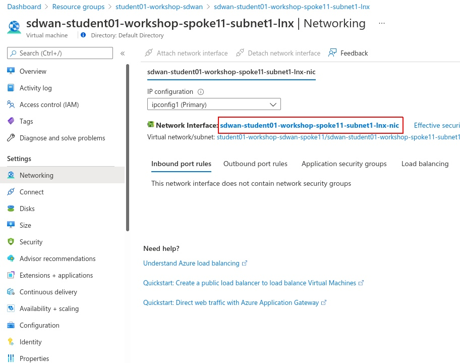
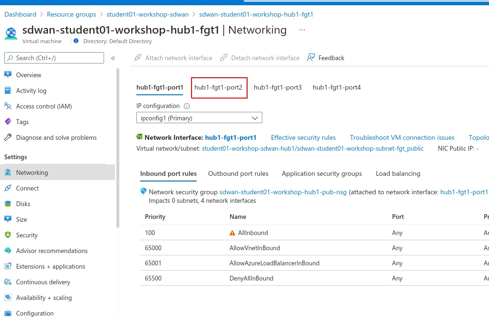
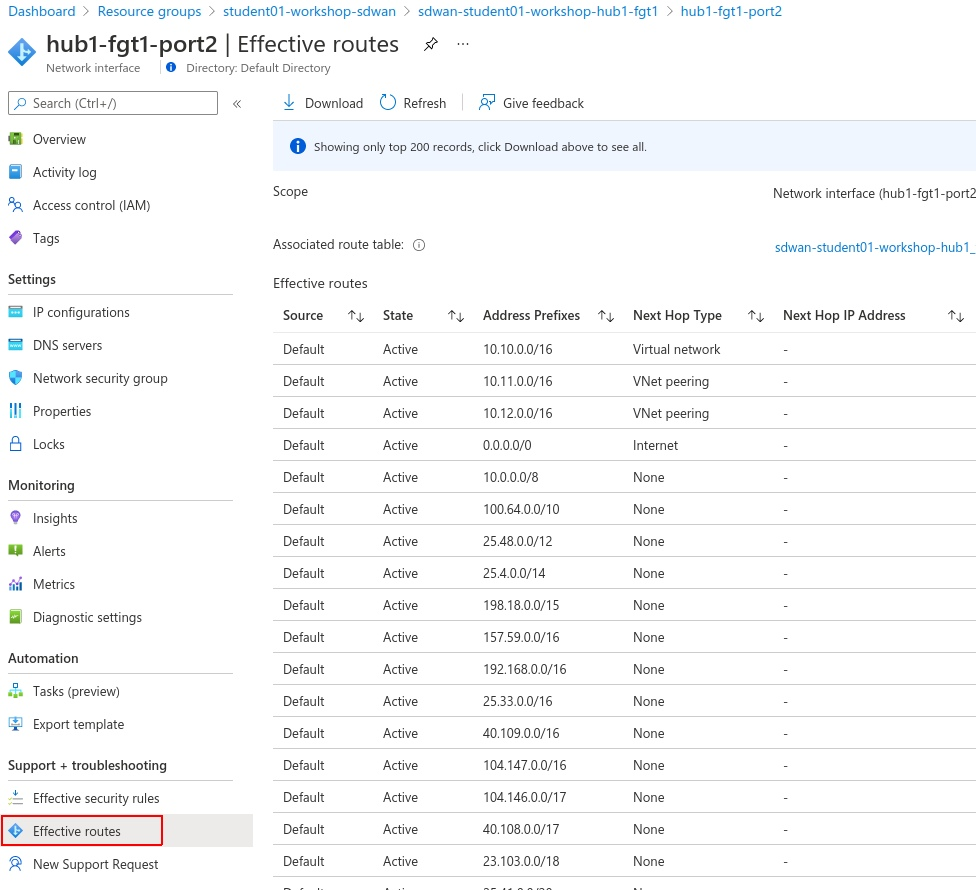

# Azure SDWAN Workshop

## Workshop main objectives
* Deploy through Terraform the SDWAN architecture
* Configure Azure components such as Azure Load Balancer, Azure VNET peering, Azure Route Server and Azure vWAN
* Understand the diffrent architecture options available

***
***
## Chapter1 - Setting up the environment (40min)
_[Deployment exercise - estimated duration 40min]_

<details>

### Task 1 - Setup your AzureCloud Shell 
* Login to Azure Cloud Portal https://portal.azure.com/ with the login/password that has been provided to you

    
    

* Click on Cloud Shell icon on the Top Right side of the portal
* Select Bash

    
    

* Click on **show advanced settings**

    

* Select **your own resource group** , use the the storage account available in that Resource Group, use the existing File Share **cloudshell**

    
                  
* You should now have access to Azure Cloud Shell console

       
### Task 2 - Run the Terraform Code
* Clone the Github repo
* Customize the Resource Group name User name , based on the user id that was assigned to you

* Run `Terraform init`
* Run `Terraform plan`
* Run `Terraform apply`

* At the end of this step you should have the following architecture
    

### Task 3 - Verifications
* Using the Terraform output verify that you have Web and SSH access to the FortiGates
* Connect to the Branch sites FortiGates and check the VPN status. If they are down try to bring them UP


### Task 4 - QUIZ
* FortiGates in the Hub do not have public IP attached to them, how are we able to access the Web UI then?
* Why the VPN are down ?

</details>

***
***
## Chapter2 - Hub and Branch VPN Connectivity (20min)
_[Configuration exercise - estimated duration 20min]_

<details>

### Task 1 - Add the FortiGates to the Hub Load Balancer Backend Pool
* Go to the Hub External Load Balancer **sdwan-student01-workshop-hub1-elb1**
* Click on Backend pools
* Add FortiGate1 and FortiGate2 port1 interfaces

    

### Task 2 - Create load balancing rules for IPSEC VPN Traffic
* Click on the Hub external Load balance and go to Load balancing rules
* Create Load balacing rules for UDP 500 and UDP 4500

    
    

        
### Task 3 - Verifications
* Verify that the FortiGate are responding to Azure Load Balancer Health Checks: click on the Hub external Load balance and then go to Insights

    

* Verify that the VPN to the Hub are UP  (please reboot the Branch FortiGate once if the VPN does not come up)

    

* Verify that the BGP peering with the hub is UP and that the Branch FortiGate learn the Hub and other Branches CIDRs

* At the end of this step you should have the following architecture
    
_[Configuration and troubleshooting exercise - estimated duration 40min]_

<details>

### Task 1 - Create the VNET peering
* Create a VNET peering between the Spoke11 VNET and the Hub VNET. Go to the Spoke VNET, studentxx-workshop-sdwan-spoke11 and then click on Peerings.
* Repeat the above between Spoke12 VNET and the Hub VNET

    

* Check now that the Branch FortiGate learn the Spoke11 VNET and Spoke12 VNET CIDRs

### Task 2 - Check Azure route server configuration and learned routes
* Go to Azure Route Server. Click on your Azure Route Server studentxx-workshop-sdwan-RouteServer.
* Click on Peers on the left side of the menu
* List the routes leanred by Azure Route Server. Run the command below from your Azure Cloud Shell

`az network routeserver peering list-learned-routes -g studentxx-workshop-sdwan --routeserver studentxx-workshop-sdwan-RouteServer --name sdwan-fgt1`

`az network routeserver peering list-learned-routes -g studentxx-workshop-sdwan --routeserver studentxx-workshop-sdwan-RouteServer --name sdwan-fgt2`


### Task 3 - Create a Dynamic SDN object [troubleshooting required]
* Is your Hub FortiGate able to see the Dynamic filters ?
    * **Trouleshoot and Make the required changes** to allow the FortiGate to retrieve the SDN filters.
    * Hints:
    =
        * FGT Branch3 is able to retrieve the filters, why that is not the case for the FortiGates Behind Load Balancers.
        * FGT Branch3 is standalone, all other FortiGates are in A-P HA, how does that affect traffic to retrieve SDN filters?

* On the Hub FortiGate, create a dynamic object that resolves to the Spoke VNETs VMs
* On the Hub FortiGate, use the object created above on policy3 to restrict traffic coming from the Branches
    
          
### Task 4 - Traffic generation
* Generate Traffic from Branch1 Primary FortiGate:  
    1. Connect to the Branch1 Primary FortiGate
    2. Configure ping-options to initiate traffic from FortiGate's private nic. 
    3. Initiate a ping to Spoke11 and Spoke12 Linux VM (10.11.1.4 and 10.12.1.4)

    

* Generate Traffic from Branch1 Linux VM:  
    1. Enable serial console access on Branch1 Linux VM
        * Click on the VM studentXX-sdwan-workshop-br1lnx1
        * Go to Boot diagnostics -> Settings ->  Select **Enable with custom storage account**
        * From the dropdown list, select the storage account that is assigned to you

            
            
    
    2. Go to the VM Serial Console
        

    3. Initiate a ping to Spoke11 and Spoke12 Linux VMs 
    ```
     ping 10.11.1.4
     ping 10.12.1.4 
     
    ```
    4. Does it work ?

* At the end of this step  you should have the following architecture
     but the Linux VM behind the Branch FortiGate is not ?
* FortiGate at the Branch1 and Branch2 are both behind Azure Load Balancer (behind NAT). Branch1 to Branch2 traffic will succesfully establish an ADVPN shortcut?

</details>

***
***
## Chapter4 - Branch to Cloud and Branch to Branch connectivity (20min)
_[Configuration exercise - estimated duration 20min]_

<details>

### Branch to Cloud

#### Task 1 - Create a route in the UDR
* Click on the Branch1 private route table (studentxx-sdwan-workshop-branch1_rt)
* Add a default route that points to the Internal Load balancer listener 
* Repeat the previous step to Branch2 and Branch3 Route Tables (please use the correct ip as the next hop)

    

#### Task 2 - Generate traffic to the Hub
* Connect to the Branch1 Linux Host via the serial console
* Generate traffic to Hub
    ```
     ping 10.11.1.4
     ping 10.12.1.4 
     
    ```
* Does it work now ?

#### Task 3 - Check effective routes
* Go to your resource group and click on Spoke11 Linux VM
* Click on Networking in the Navigation Menu
    

* Click on the VM nic
    

* Click on **Effective routes**
    

* Check that Azure Route Server has injected the Branch sites CIDRs learnt from the FGT

* Go to your resource group and click on the Hub FGT VM
* Click on Networking in the Navigation Menu
    

* Click on the VM port2 nic
    

* Click on **Effective routes**
    

* Has Azure Route Server injected the Branch sites CIDRs learnt from the FGT?  Why ?

### Branch to Branch
#### Task 4 - Generate traffic between Branches
* Connect to the Branch1 Linux Host via the serial console
* Generate traffic to Branch2 Linux Host
   ```
     ping 172.17.5.4
     
    ```
* Check if an ADVPN shortcut has been created

### Task 5 - QUIZ
* Why Azure Route Server (ARS) has injected the Branch sites CIDRs to the Spoke VNET protected subnet but not the FortiGate private subnet?

* The Branch external Load balancer has two front end public ip. How do we ensure that traffic egressing Branch1 on port1 (isp1)  has always the same public ip applied? Same for traffic egressing Branch1 on port3 (isp2)


</details>

***
***
## Chapter5 - Redundancy (20min)
_[failover exercise - estimated duration 20min]_

<details>

### Task 1 - Generate ICMP traffic
* Access the serial console by clicking on the VM studentXX-sdwan-workshop-br1lnx1 and then Serial Console
* Ping a resource in the Hub as well as in a remote branch site `ping 10.11.1.4`
### Task 2 - Initiate a failover
* Connect to the Branch1 Primary FortiGate . Initiate a failover by rebooting the primary FortiGate
* Monitor the number of **lost Pings** and the **failover time**
* How long did it take ?
* Have the VPNs to the Hub been renegotiated upon failover or maintained ?

    

### Task 3 - Generate TCP traffic
* Ensure that both units of Branch1 FGT in the cluster is up and running
* Access the serial console of Branch1 Linux VM by clicking on the VM studentXX-sdwan-workshop-br1lnx1 and then click on Serial Console
* Generate an SSH session to the Hub Linux VM 

   ```
   ssh studentxx@10.11.1.4
   
   ```
* From Hub Linux VM SSH session generate a continous stream of connections to track the failover event 
   
   ```
   while true; date; do curl -I -sw '%{http_code}'  https://www.lemonde.fr/ ; echo -e "\n================="; sleep 1 ; done

   ```   
* Connect to the Branch1 Primary FortiGate . Initiate a failover by rebooting the primary FortiGate
* Monitor the SSH connexion
* Did you lose the TCP connexion ?
### Task 6 - QUIZ
* How long was your failover time ? 

* Why did we lose the SSH (TCP) session with a "short" failover time ? 

</details>

***
***
## Chapter 6 - Scaling (20min)
_[Presentation - estimated duration 20min]_
<details>

</details>

***
***

## Chapter 7 - Azure virtualWAN [estimated duration 60min]
_[Configuration exercise - estimated duration 20min]_

<details>

</details>